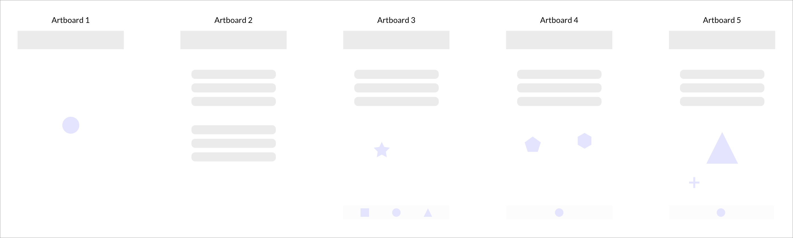
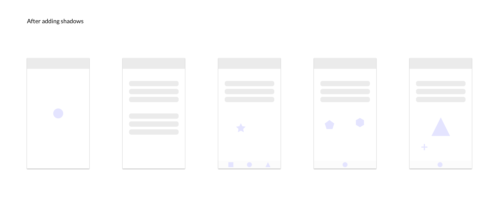

# add-artboard-shadows
A sketch plugin that makes your user flows look better, by adding more contrast between the artboards and background.

# Why this plugin?
- We sometimes need to share user flows as static images or docs (as opposed to prototypes).
- So we create a slice around a sequence of artboards, and export that slice.
- Sketch doesn't retain the artboard shadows that you see on the editor, when you export them.
- As a result your artboards are sometimes hard to distinguish from the background.

** Exported slice before using the plugin**

**Exported slice after**

# Installation
- Download the zip file from this project.
- Double click the .sketchplugin file.

# Usage
- On any page that has artboards of any size, run the plugin.
- You can find a group titled 'Artboard Shadows' beneath all the layers on the page.

Here is a video demonstrating its use.
